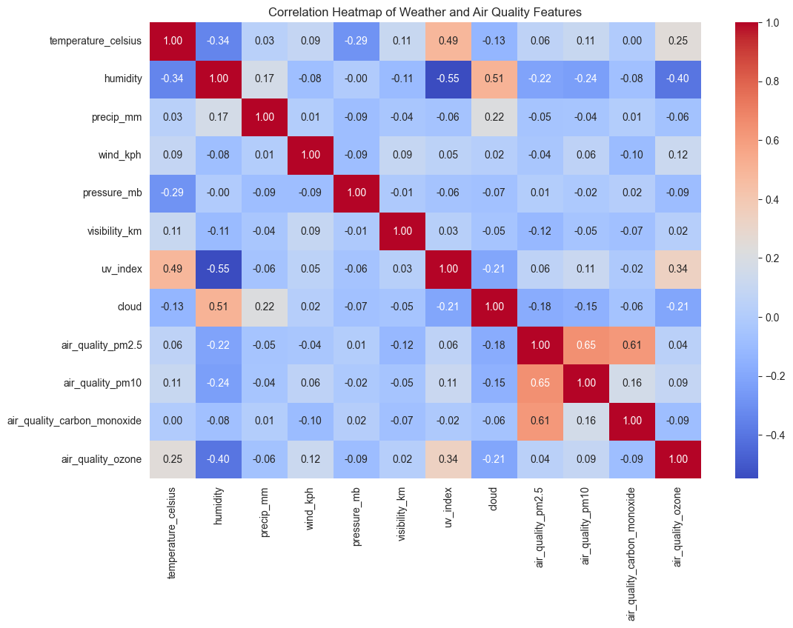
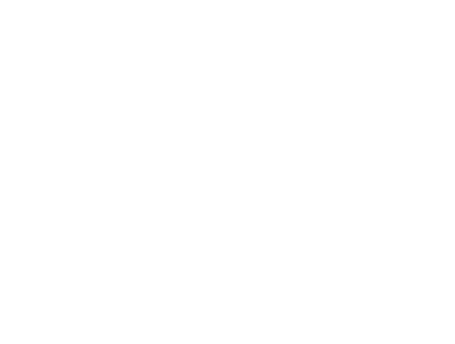
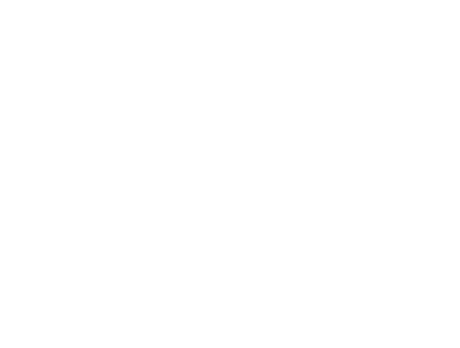
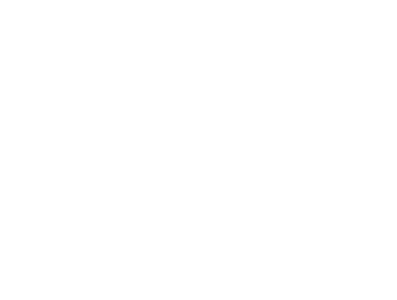

# Global Weather Trend Forecasting and Climate Analysis

## Project Overview

This project analyzes the **Global Weather Repository** dataset to explore worldwide weather patterns, environmental conditions, and climate behavior using data science and machine learning techniques.

The project includes:

* Data cleaning and preprocessing
* Exploratory Data Analysis (EDA)
* Climate and environmental analysis
* Spatial and geographical analysis
* Anomaly detection
* Feature importance analysis
* Time series forecasting using multiple models
* Ensemble forecasting and model comparison

The analysis combines statistical exploration, machine learning, and visualization techniques to better understand global weather behavior and forecast temperature trends.

---

## Objectives

The main objectives of this project are:

* Analyze global weather trends and environmental patterns
* Identify correlations between weather and air quality variables
* Detect unusual environmental and weather anomalies
* Study seasonal and geographical climate behavior
* Build and evaluate multiple forecasting models
* Compare forecasting performance using standard evaluation metrics
* Create an ensemble forecasting approach for improved robustness

---

## Dataset

Dataset Source:

* Global Weather Repository Dataset from Kaggle
* [https://www.kaggle.com/datasets/nelgiriyewithana/global-weather-repository](https://www.kaggle.com/datasets/nelgiriyewithana/global-weather-repository)

The dataset contains global daily weather observations from cities around the world.

### Dataset Features

The dataset includes:

* Temperature and humidity measurements
* Wind speed and atmospheric pressure
* Precipitation and visibility
* Air quality indicators
* UV index and cloud cover
* Geographical coordinates
* Sunrise/sunset and moon information
* Timestamp-based weather observations

---

## Technologies Used

### Programming Language

* Python

### Libraries and Frameworks

* Pandas
* NumPy
* Matplotlib
* Seaborn
* Plotly
* Scikit-learn
* XGBoost
* Prophet

### Machine Learning Techniques

* Time Series Forecasting
* Ensemble Learning
* Isolation Forest
* Feature Importance Analysis

---

## Project Workflow

1. Data Cleaning and Preprocessing
2. Exploratory Data Analysis (EDA)
3. Climate and Environmental Analysis
4. Spatial and Geographical Analysis
5. Anomaly Detection
6. Feature Importance Analysis
7. Forecasting Model Development
8. Ensemble Forecasting and Evaluation

---

# Data Cleaning and Preprocessing

The preprocessing stage included:

* Datetime conversion and parsing
* Temporal feature engineering
* Outlier analysis
* Seasonal feature generation
* Time-based feature extraction

### Engineered Features

Additional features created during preprocessing include:

* Year
* Month
* Day
* Hour
* Day of year
* Weekday
* Season
* Weekend indicator
* Day/Night indicator
* Temperature difference

---

# Exploratory Data Analysis (EDA)

EDA was performed to identify trends, correlations, and environmental patterns in the dataset.

### Analyses Performed

* Temperature distribution analysis
* Humidity distribution analysis
* Precipitation trend analysis
* Correlation analysis
* Seasonal climate analysis
* Geographical weather analysis
* Air quality analysis

---

# Advanced Analyses

## Climate Analysis

Seasonal and monthly weather patterns were analyzed to study long-term climate behavior.

Key findings:

* Clear seasonal temperature variation was observed
* Summer months showed higher average temperatures and precipitation
* Strong annual seasonality was visible in the forecasting time series

---

## Environmental Impact Analysis

Air quality indicators were analyzed alongside weather variables.

Key findings:

* PM2.5 and PM10 showed strong positive correlation
* Carbon monoxide correlated strongly with particulate pollution
* Several regions showed elevated pollution concentrations

---

## Spatial and Geographical Analysis

Spatial visualizations were created to analyze worldwide weather patterns.

Analyses included:

* Global temperature distribution map
* Global PM2.5 distribution map
* Global precipitation distribution map
* Country-level climate comparisons

---

## Anomaly Detection

Isolation Forest was used to detect unusual environmental observations.

The anomaly detection analysis identified:

* Severe pollution events
* Extreme weather conditions
* Environmental outliers with unusually high PM2.5 concentrations

---

## Feature Importance Analysis

XGBoost feature importance analysis was performed to identify variables influencing temperature prediction.

Key influential features included:

* UV Index
* Atmospheric Pressure
* Humidity
* Visibility
* Cloud Cover

---

# Forecasting Models

Temperature forecasting was performed using Tokyo weather observations.

### Forecasting Models Implemented

1. Baseline Moving Average Model
2. Random Forest Regressor
3. XGBoost Regressor
4. Ensemble Forecasting Model

### Forecasting Features

The forecasting pipeline used:

* Lag features
* Rolling averages
* Temporal features
* Seasonal indicators

---

# Model Evaluation

The models were evaluated using:

* MAE (Mean Absolute Error)
* RMSE (Root Mean Squared Error)
* R² Score
* MAPE (Mean Absolute Percentage Error)

### Key Results

* The Baseline Moving Average model achieved the best overall forecasting performance.
* The ensemble model improved robustness compared to individual machine learning models.
* The forecasting results demonstrated strong seasonal behavior in Tokyo temperature patterns.

---

# Visualizations

## Correlation Heatmap



---

## Monthly Temperature Trend



---

## Global Temperature Distribution Map


---

## Environmental Anomaly Detection



---

## Forecasting Results



---

# Repository Structure

```text
weather-trend-forecasting-analysis/
│
├── data/
│   ├── raw/
│   └── processed/
│
├── notebooks/
│   ├── 01_data_cleaning_preprocessing.ipynb
│   ├── 02_eda_advanced_analysis.ipynb
│   └── 03_forecasting_models.ipynb
│
├── visuals/
├── reports/
├── src/
├── requirements.txt
├── README.md
└── .gitignore
```

---

# How to Run

## 1. Clone Repository

```bash
git clone <repository-url>
cd weather-trend-forecasting-analysis
```

## 2. Create Environment

```bash
conda create -n weather_forecasting python=3.11
conda activate weather_forecasting
```

## 3. Install Dependencies

```bash
pip install -r requirements.txt
```

## 4. Run Jupyter Notebook

```bash
jupyter notebook
```

---

# Future Improvements

Potential future enhancements include:

* Deep learning forecasting using LSTM models
* Streamlit dashboard deployment
* Real-time weather API integration
* Region-specific forecasting systems
* Advanced geospatial climate analysis

---

# Key Project Insights

* Global weather data exhibits strong seasonal and temporal behavior.
* Temperature forecasting benefited significantly from lag and rolling-window features.
* Air quality indicators such as PM2.5 and PM10 demonstrated meaningful environmental relationships.
* Spatial analysis revealed clear geographical variation in climate and pollution conditions.
* Isolation Forest successfully identified unusual environmental events and pollution anomalies.
* Simpler forecasting approaches performed competitively due to strong temporal smoothness in the dataset.

---

# PM Accelerator Mission

This project was developed as part of the PM Accelerator technical assessment.

PM Accelerator focuses on helping aspiring professionals gain practical, real-world experience through hands-on projects, collaboration, innovation, and career-focused learning opportunities in technology, product management, artificial intelligence, and data science.

This project aligns with that mission by applying data science and machine learning techniques to solve real-world environmental and forecasting challenges using practical analytical workflows.

The project demonstrates practical applications of:

* Data Science
* Machine Learning
* Forecasting
* Environmental Analysis
* Data Visualization

through a real-world weather analytics workflow.

---

# Author

Rahul Pandey

* LinkedIn: [https://www.linkedin.com/in/rahulpandey9k](https://www.linkedin.com/in/rahulpandey9k)
* GitHub: [https://github.com/rahul-9k](https://github.com/rahul-9k)
